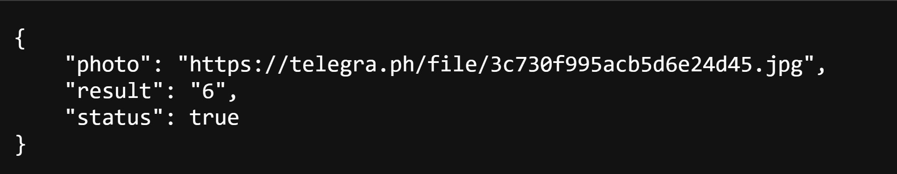

<p align="center">
    <a href="https://github.com/H7AM0/GmailBox">
        
    </a>
    <br>
    <b>Hamo • حـمــو</b>
    <br>
    <a href="https://www.instagram.com/4.4cq/">
        Instagram
    </a>
     • 
    <a href="https://t.me/hamo_back">
        Telegram
    </a>
</p>


**Create a simple captcha equation**

* Script I made in python 3.
* With this tool, create a captcha equation in an image.
* Gives you the image and the result. 
* Script and API
****

# main.py
A script explaining the creation of the captcha and the simple equation

* The captcha is created with the name verification.jpg
* Print the result of the equation after creating the captcha

Example of a generated captcha


****

# api.py
It is the json API

## It appears:
* Created captcha link
* The result of the created equation appears

Example of a api response


****

#Install libraries
```shell
pip install -r requirements.txt
```
****

## I also want to make you aware that:
* This was written for educational purpose only.
* The author will not be responsible for any damage ..!
* The author of this tool is not responsible for any misuse of the information.
* You will not misuse the information to gain unauthorized access.
* This information shall only be used to expand knowledge and not for
causing malicious or damaging attacks.
* Performing any hacks without written permission is illegal ..!
****

# Contact to coder

## * [Instagram](https://www.instagram.com/4.4cq/)
## * [Telegram](https://t.me/hamo_back)
