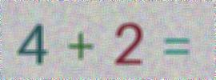

    
     
    <b>Hamo • حـمــو</b>
     
    <a href="https://www.instagram.com/4.4cq/">
        Instagram
    </a>
     • 
    <a href="https://t.me/hamo_back">
        Telegram
    </a>

**Create a simple captcha equation**

* Script I made in python 3.
* With this tool, create a captcha equation in an image.
* Gives you the image and the result. 
* Script and API
****

## main.py
A script explaining the creation of the captcha and the simple equation

* The captcha is created with the name verification.jpg
* Print the result of the equation after creating the captcha

Example of a generated captcha

****

## api.py
It is the json API

#It appears:
*Created captcha link
*The result of the created equation appears

Example of a api response

****
